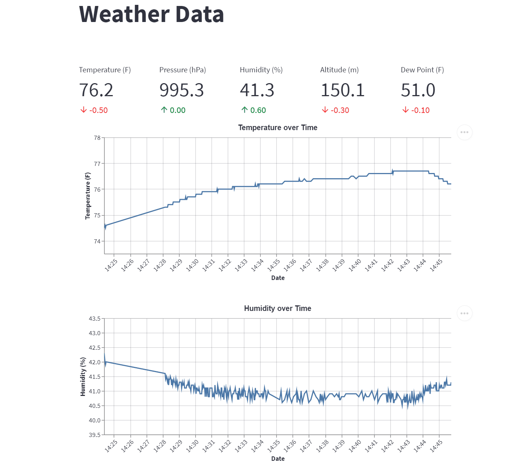
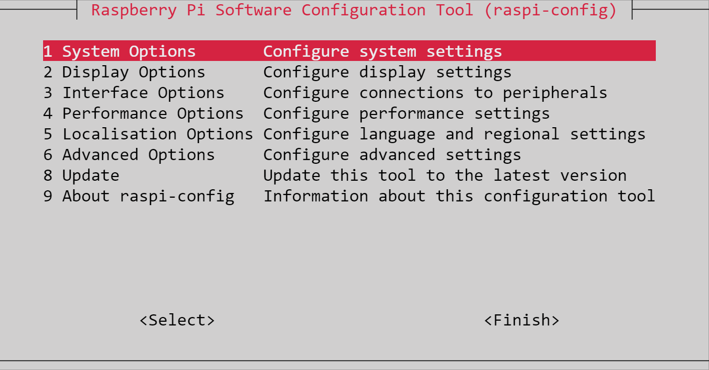
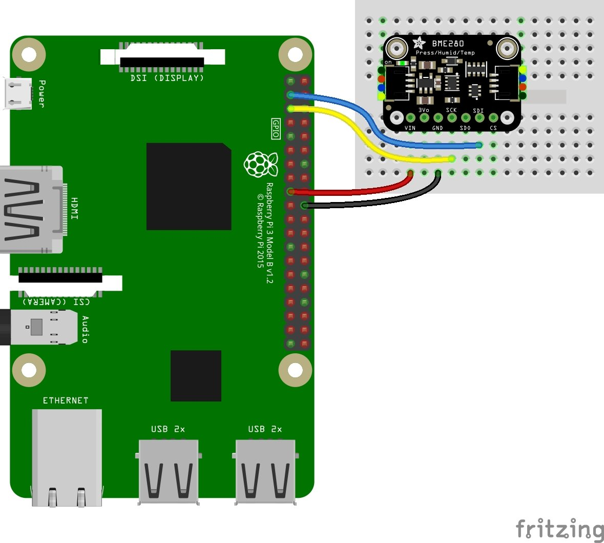

# </img>Pimospheric - A Python Weather Data Collection Application

*Utilizes the [BME280 Environmental Sensor](https://www.amazon.com/dp/B088HJHJXG?psc=1&ref=ppx_yo2ov_dt_b_product_details) to connect to a raspberry pi to take the readings of meteorological data.*     



Sensor Data Collects the Following:     

- Temperature (degrees Celsius)
- Atmospheric Pressure (hectopascals, hPa)
- Relative Humidity (%RH)
- Altitude (meters, m)

Dewpoint is derived using the temperature and relative humidity readings. 

### Requirements

------

The application requires the following dependencies:

- adafruit-circuitpython-bme280
- adafruit-circuitpython-lis3dh
- MetPy
- streamlit

The dependencies can be installed via the `requirements.txt` file via `pip install -r requirements.txt`. I suggest installing these in a virtual environment as many of the features are very "experimental" and may not be guaranteed to work out of the box.

## Getting Started

------

I have the Raspberry Pi model 4B (4gb of RAM) and I will be using this device for this project. I started by downloading Raspberry Pi Imager v1.7.2 from https://www.raspberrypi.com/software/. Once the software is installed, I selected to install Raspberry Pi OS Lite (64-bit) for a headless install. Next, I inserted the SD card and formatted it. The latest Imager software has a gear icon in the bottom-right corner of the screen that appears after you select the operating system. I pre-configured the pi's hostname, ssh, and wireless network settings so that I can ssh directly into the pi once it is powered up.

### SSH Into the Pi and Install Dependencies

------

To get things started, SSH into the pi. By default, a fresh install of Raspberry Pi OS does not come with `git`, `python3-pip`, or `python3-venv` installed. So, I recommend updating (`sudo apt update`) the repository list and installing these. Once logged into the pi, setup a virtual environment for testing purposes. I'm also cloning the repository to my self-hosted gitlab server for version control.

Next, pip install the CircuitPython driver from the PyPI repository with `pip3 install adafruit-circuitpython-bme280` and the CiruitPython library with `pip3 install adafruit-circuitpython-lis3dh`.


## Selecting A Kernel Interface for Receiving Sensor Data

------

This step is important because, depending on the interface you select, you will need to configure your wiring and code a particular way. There are a number of resources online that explain the pros and cons for each interface but I found [this article](https://learn.sparkfun.com/tutorials/raspberry-pi-spi-and-i2c-tutorial/all) provided a sufficient explanation of the difference between the two.

For this project I will be using the I2C Kernel for simplicity's sake. Also, I find it easier to test/detect board hardware so it makes life a little easier for troubleshooting. <span style="color:cyan">*If you choose to go down the SPI path, note that the wiring and code will be different compared to I2C*</span> and I suggest you look at different tutorials that use this format.

### Enable I2C 

------

Once the drivers and libraries are installed, the I2C kernel drivers need to be enabled before going further. To do so, run `sudo raspi-config` and find the interfaces section and enable I2C and SPI. Once done, reboot the pi with `sudo reboot`.



### Wiring the BME280

------

**Bonus Tip: If you're looking for a really good pinout diagram for the pi, I strongly recommend checking out https://pinout.xyz/ to see what each pin is used for.**

I recommend shutting down the Pi first, removing the power supply, then attaching the GPIO pins. See the table below:

| Color  | Pin Number | BME280 |
| ------ | :--------: | -----: |
| Blue   |     3      |    SDI |
| Yellow |     5      |    SDO |
| Red    |     17     |    VCC |
| Black  |     20     |    GND |
| Orange |   Unused   |        |
| Green  |   Unused   |        |



Once the wires have been connected/soldered (based on your preference), boot the pi back up.

### Verify the Pi Can Read the BME280

------

First, verify that the I2C Kernel has started up using `lsmod | grep -E 'i2c_bcm'`. You should see a result similar to the one shown below.

```bash
pi@raspberrypi:~ $ lsmod | grep 'i2c_bcm'
i2c_bcm2835            16384  0
```

Test to ensure that there are no grounds. To do so, install i2c-tools with `sudo apt-get install i2c-tools`. Then, test the connections with `i2cdetect -y 1`.

```bash
pi@raspberrypi:~ $ i2cdetect -y 1
     0  1  2  3  4  5  6  7  8  9  a  b  c  d  e  f 
00:                         -- -- -- -- -- -- -- -- 
10: -- -- -- -- -- -- -- -- -- -- -- -- -- -- -- -- 
20: -- -- -- -- -- -- -- -- -- -- -- -- -- -- -- -- 
30: -- -- -- -- -- -- -- -- -- -- -- -- -- -- -- -- 
40: -- -- -- -- -- -- -- -- -- -- -- -- -- -- -- -- 
50: -- -- -- -- -- -- -- -- -- -- -- -- -- -- -- -- 
60: -- -- -- -- -- -- -- -- -- -- -- -- -- -- -- -- 
70: -- -- -- -- -- -- -- 77
```

Note, this should be the output if there are no issues (i.e. 77 means that the BME280 is successfully connected to the Pi). If for some reason, you see a 76 instead, check the cables for a ground or loose wiring as an error is being detected.

### Output Data to Console

------

Everything is now setup for collecting our first batch of data. I created a very basic file to collect the temperature, humidity, and pressure readings and output these values to the console:

```python
"""" basic_reading.py """

import board
from adafruit_bme280 import basic as adafruit_bme280

def main():
    i2c = board.I2C()
    bme280 = adafruit_bme280.Adafruit_BME280_I2C(i2c)
    print("\nTemperature: %0.1f C" % bme280.temperature)
    print("Humidity: %0.1f %%" % bme280.humidity)
    print("Pressure: %0.1f hPa" % bme280.pressure)

if __name__ == "__main__":
    main()
```


### Optional: Setting Up the Web App

------

If you're interested in going the extra mile (you've already made it this far...so why not!), you can make a full fledged web app and customize the data displayed into a beautiful dashboard. For this purpose, I utilized https://streamlit.io. It's a super easy-to-use and powerful data-visualization service. At this point, if you haven't installed the requirements/dependencies yet, you will need to do so now.

To start the app:

```bash
(venv) pi@raspberrypi:~/pimospheric $ streamlit run app.py

  You can now view your Streamlit app in your browser.

  Network URL: http://10.0.0.10:8501
  External URL: http://0.0.0.0:8501


```

Once the app is up an running, you can head over to the provided URL and view your weather tracking site.


### Sources

- Product page: https://www.waveshare.com/bme280-environmental-sensor.htm 
- BME 280 Wikipedia Page: https://www.waveshare.com/wiki/BME280_Environmental_Sensor 
- Adafruit Tutorial (Recommended first source): https://learn.adafruit.com/adafruit-bme280-humidity-barometric-pressure-temperature-sensor-breakout/python-circuitpython-test 
- BME280 CircuitPython repository - https://github.com/adafruit/Adafruit_CircuitPython_BME280 

